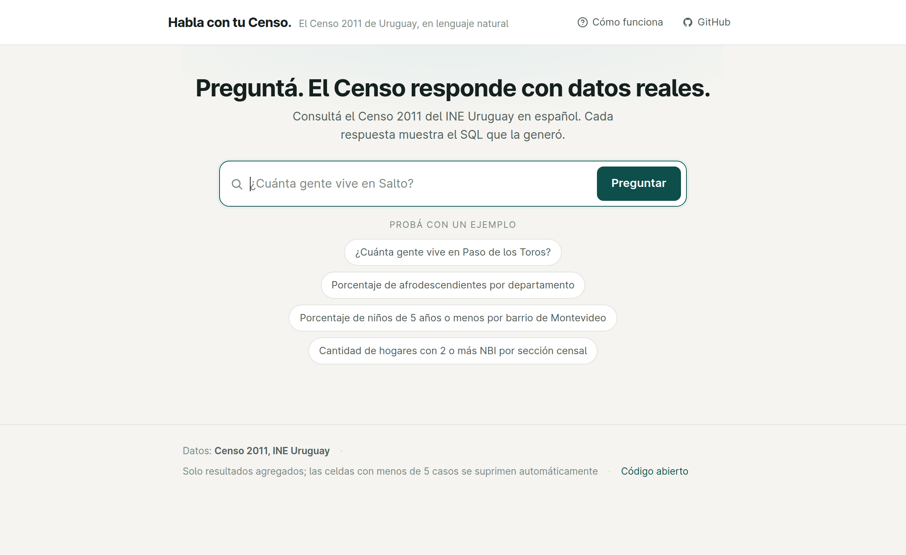
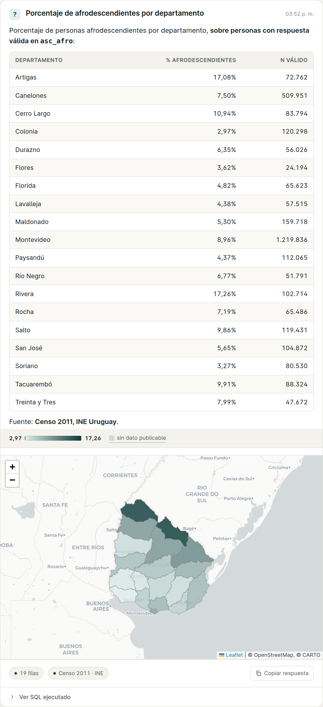
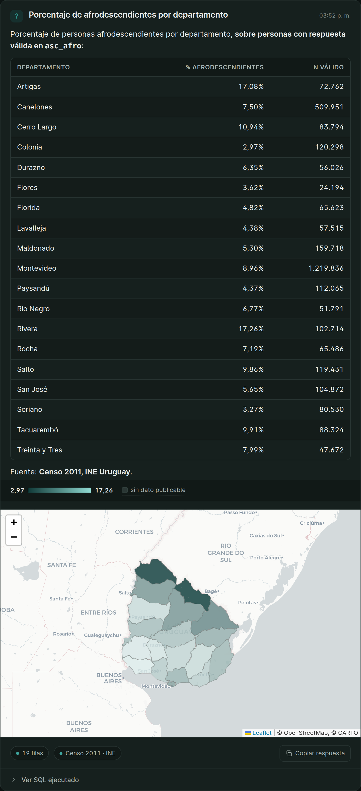

# Habla con tu Censo

**English** · [Español](README.es.md)

*Talk to your Census — natural-language interface over Uruguay's census microdata (2011 & 2023)*

**Ask Uruguay's 2011 and 2023 Censuses questions in plain Spanish. Pick the
census with a selector; answers are computed from the official microdata —
never from an LLM's memory — and the executed SQL is shown on every answer.**

**Live demo: https://srv1236510.hstgr.cloud/**

A working prototype of a natural-language query layer for national statistical
offices, built as a modern, auditable alternative to legacy dissemination tools
(REDATAM).

<p align="center">
  
</p>

Ask in plain Spanish and get an answer computed from the microdata — with a
choropleth map when the query is geographic, the valid universe and any
suppressed cells labelled, and the exact SQL one click away:

<p align="center">
  
</p>

<details>
<summary>Dark theme (same result)</summary>

<p align="center">
  
</p>

</details>

<sub>Light/dark themes, responsive to mobile, and the executed SQL shown on
every answer.</sub>

## What it is

A conversational interface over the **person-level microdata of Uruguay's 2011
and 2023 Censuses** (INE). A selector in the interface chooses the census;
**2023 is the default**. Each answer is tagged with the census it came from.

- **2011** — the `personas` table holds one row per person, **3,285,824 records**
  across **155 columns**: the **145 raw INE variables** (kept with their original
  codes) plus readable **derived columns** (`departamento`, `sexo`, `edad`,
  `asc_afro`, `asc_principal`, `nbi`, `codsec`, `codloc`) and structural keys
  (`hogar_key`, `vivienda_key`). A `localidades` reference table resolves place
  names. Counts are **exact**.
- **2023 (weighted)** — the INE's weighted census. Person figures are
  **estimates**: the published number is `SUM(W)` over the weight variable, so the
  interface rounds them and labels them as weighted estimates. Households
  (`COUNT(DISTINCT hogar_key)`) and dwellings (a separate `viviendas_2023` table)
  are **exact counts**. Place names resolve through the official nomenclator
  (departments, localities, census tracts and segments, Montevideo neighbourhoods).

A question in Spanish is translated to SQL by an LLM, the SQL is validated by a
real parser, executed over SQLite, disclosure-controlled, and only then turned
back into prose that cites the actual numbers.

## What you can ask

- **Counts** of persons, households or dwellings —
  `COUNT(*)`, `COUNT(DISTINCT hogar_key)`, `COUNT(DISTINCT vivienda_key)`
  (household and dwelling variables repeat on every member, so distinct counts
  are enforced).
- **Frequencies** of any of the 145 variables (e.g. dwellings by type,
  households by number of Unsatisfied Basic Needs).
- **Percentages** with **automatic exclusion of missing values**: codes flagged
  as not-surveyed / not-applicable / unknown / statistical-secrecy (and NULLs)
  are always dropped from counts and denominators — a rate is never presented
  over the total population when the variable has missing data.
- **Hierarchical selection** — REDATAM-style subqueries expressing conditions on
  *other* household members (e.g. "people in households where at least one member
  is over 75").
- **Four geographic levels** — department, locality (by name, via the
  `localidades` table), Montevideo neighbourhood (`BARRIO85`) / CCZ, and census
  tract (`codsec`) — with **choropleth Leaflet maps** rendered for the mappable
  levels (department, census tract, Montevideo neighbourhood, CCZ).
- **Place of birth and internal migration** — persons born abroad, by country
  (resolved through the official INE country classifier, `datos/paises.csv`, joined
  like `localidades`), and the internal migration matrix (born in department X,
  living in Y). Country and birth-department codes come from the nomenclator, never
  from the model's memory. See `datos/NOTAS_CALIDAD.md` for the coding details.

## Statistical disclosure control

Because the underlying table is microdata (one row per person), the validation
gate (`app/sql_guard.py`) is built on a **real SQL parser (`sqlglot`)** working
on the parsed tree, not on text matching:

1. **Aggregate-only output** — every column of the outer projection must be an
   aggregate or a `GROUP BY` column; `SELECT *` and bare column selection are
   rejected. Individual rows can never be returned.
2. **Structural small-cell suppression** — the guard identifies *on the tree*
   which output columns are counts and hands them to the suppressor; any result
   cell with fewer than **5 persons** is dropped after execution (standard NSO
   practice). Suppressed geographies render as grey ("sin dato publicable") on
   the maps.
3. **Fail-closed** — if the guard cannot prove a query safe (unparseable, counts
   not identifiable, disallowed table/column/function), it is **not executed**
   and no answer is improvised.
4. **Defense-in-depth** — single `SELECT` statement only; table whitelist
   (`personas`, `localidades`, `paises`) with joins allowed only on the nomenclator
   keys (`codloc`, country code); column
   whitelist from the dictionary; re-identifying keys (`hogar_key`,
   `vivienda_key`) allowed in the outer projection only inside
   `COUNT(DISTINCT …)`; dangerous SQLite functions blocked; mandatory, capped
   `LIMIT`.

The suppression threshold, whitelist and prompt are **configuration derived from
the dictionary, not hand-written code**.

## Architecture

```
question (ES) → LLM writes SQL → sqlglot validation gate → SQLite over microdata
             → small-cell suppression → LLM writes the answer from real numbers
             → choropleth map (Leaflet) when the query is geographic
```

**FastAPI + SQLite + OpenAI + Leaflet**, ~vanilla single-page front-end (no build
step). The schema text the model sees, the column whitelist the guard enforces,
and the missing-value rules are **all generated from a data dictionary** — the
public INE metadata for each census — not hand-written code. The same pattern
runs **two engines behind one selector**: the 2011 engine (`app/main.py`,
`app/sql_guard.py`) and the 2023 weighted engine (`consultar_2023.py`,
`sql_guard_2023.py`), each with its own dictionary and disclosure rules, sharing
the front-end, the Leaflet maps and the aggregate-only guarantee. The model is
configurable via the `CENSO_MODELO` environment variable.

## Run it

```bash
pip install -r requirements.txt

# The INE microdata file is NOT included in this repo (it is not ours to
# redistribute). Download the Census 2011 persons microdata from
# https://www.ine.gub.uy and place the .sav in datos/.
# The expected file is "Base unificada Viv_Hog_Pers.sav".

# 1. Generate the data dictionary — schema, whitelist and LLM prompt all derive
#    from this file. Metadata only: it reads labels, not microdata.
python datos/generar_diccionario.py "datos/Base unificada Viv_Hog_Pers.sav"

# 2. Verify the column mapping against your file before loading (this is also
#    the module cargar.py imports its derivation rules from).
python datos/convertir_ine.py --inspeccionar "datos/Base unificada Viv_Hog_Pers.sav"

# 3. Build the database (datos/censo.db). Reads the .sav in chunks — no
#    intermediate CSV — loading the 145 raw variables + derived columns + the
#    localidades reference table.
python datos/cargar.py "datos/Base unificada Viv_Hog_Pers.sav"

# 4. Set your OpenAI key
export OPENAI_API_KEY=sk-...

# 5. Launch
uvicorn app.main:app --reload
```

Then open http://localhost:8000 and ask, for example:
*"¿Cuántas mujeres mayores de 75 años hay en Rivera?"*

> The steps above build the **2011** database. The **2023 weighted** census
> (`consultar_2023.py`, `sql_guard_2023.py`) runs against its own database,
> prepared separately from the INE's weighted microdata and nomenclator; that
> microdata and its loading pipeline are not part of this repository. The 2023
> data dictionary and the GeoJSON map layers used at runtime **are** included.

Key columns of the `personas` table:

| Column | Description |
|---|---|
| `departamento`, `sexo`, `edad` | Department (19 values), sex, age in years |
| `asc_afro` | Mention of Afro/Black ancestry (`Si`/`No`/NULL) |
| `asc_principal` | Main declared ancestry (only for those declaring more than one) |
| `nbi` | Household's Unsatisfied Basic Needs (0–3, capped at "3 or more") |
| `codsec`, `codloc`, `BARRIO85`, `CCZ` | Census tract, locality, Montevideo neighbourhood / CCZ |
| `hogar_key`, `vivienda_key` | Household / dwelling id (only inside `COUNT(DISTINCT …)`) |
| *145 raw INE variables* | Original codes (e.g. `VIVVO03`, `HOGPR01`), with the dictionary's value labels |

Missing values (not surveyed, collective dwellings, statistical secrecy) are
stored as NULL and always excluded from counts and denominators.

## Data quality & scope

The **2011** persons microdata contains **occupied dwellings only**, so questions
about **vacant / unoccupied dwellings** are out of scope there and return a clear
message (`NO_RESPONDIBLE_VIVIENDAS`) rather than a wrong answer. The **2023**
census has a dedicated dwellings table, so vacant-dwelling questions *are*
answerable under the 2023 selector. Loading counts, the household/`PERID`
consistency note, place-of-birth coding, and the full 2011 scope limitation are
documented in [`datos/NOTAS_CALIDAD.md`](datos/NOTAS_CALIDAD.md).

**Locality nomenclator.** The **2011** locality names are validated against the
official INE classifier (615/615 localities). The **2023** locality nomenclator is
**provisional**: the INE has not yet released the updated 2023 version, so 2023
locality-name resolution leans on the 2011 base and may differ for new or redrawn
localities.

## Tests

```bash
pytest
```

The suite covers the security gate (`test_sql_guard.py`: injection attempts,
row-level extraction attempts, table/column whitelisting, `COUNT(DISTINCT)`
enforcement on keys, small-cell suppression), the map-level detection
(`test_mapa.py`), department-name normalization (`test_normalizar.py`) and the
`.sav` text repair (`test_reparar.py`).

## Why this exists

Most statistical offices in Latin America still disseminate census data through
tools designed in the 1990s. This prototype shows that a safe, auditable,
LLM-powered query layer over official microdata — with disclosure control
enforced by a parser, not by trust in the model — can be built in a few hundred
lines of Python.

## Roadmap

Development continues along three lines:

**Cross-census comparison (2011–2023).** The system will compute the same indicator
in each census — each under its own counting and suppression rules — and compose the
comparison with automatic methodological caveats. The centerpiece is an explicit,
reviewable harmonization layer: a public file documenting, variable by variable, what
is comparable across censuses, under which code mapping, and with which mandatory
caveat. Comparisons that are not methodologically defensible (e.g., fine-grained
geography redrawn between rounds) are not enabled. Harmonization is statistical
judgment, not code: every entry requires an expert verdict before activation.

**Exposure as an MCP server.** The same structural validation and suppression layer
that protects the web interface can be exposed through the Model Context Protocol,
allowing any AI assistant to query census microdata while receiving only publishable
aggregates. The validator acts as a statistical disclosure firewall, independent of
whichever model authors the query — extending AI-accessible public data ecosystems
into the layer that open-data tooling does not reach.

**New sources.** The architecture generates its schema, whitelist, and prompt from
each source's official documentation, so adding other censuses from the region's 2020
round — or household surveys — is a loading-and-configuration problem, not a rewrite.
Planned extensions include chat-defined derived variables and additional bases.

## Author

Carlos Aloisio — sociologist, statistician and developer (Montevideo, UY).
Builder of Uruguay's National Observatory on Sexual and Reproductive Health
(AI-assisted evidence system, Ministry of Public Health / UNFPA, 2025–2026).

Contact: caloisio@gmail.com

## License

MIT
